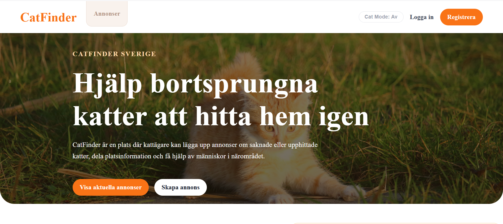

  

A full-stack lost & found cat platform built with ASP.NET Core, React, and SQL Server.
Users can create advertisements for missing or found cats, comment on listings, save advertisements, and manage their account securely using JWT authentication.

## Preview Screenshots

  
  
  

## Why CatFinder Exists

CatFinder was created to solve a common issue many pet owners face when searching for lost or found cats online.
Today, most missing-cat posts are scattered across Facebook groups, local forums, and outdated websites with inconsistent design and poor accessibility. We wanted to create a centralized platform where users can quickly create, browse, and interact with advertisements in a clean and user-friendly environment.
Our goal with CatFinder is to provide a modern, accessible, and community-driven platform dedicated entirely to helping reunite cats with their owners.

## Architecture

CatFinder follows Clean Architecture principles combined with CQRS using MediatR.

The backend is structured into:
- API Layer
- Application Layer
- Domain Layer
- Infrastructure Layer

This separation improves:
- scalability
- maintainability
- testability
- separation of concerns

## Highlights

- JWT Authentication & Authorization
- Clean Architecture + CQRS
- Repository Pattern
- React Query data caching
- Zustand authentication persistence
- SQL Server + Entity Framework Core
- Role-based access support (RBAC)

## Deployment

CatFinder is currently under active development and is planned to be deployed to a cloud-hosted VPS environment using providers such as DigitalOcean.

Planned deployment features include:
- Reverse proxy with Nginx
- HTTPS with SSL certificates
- SQL Server hosting
- Environment-based configuration
- Production-ready API hosting

## Live Demo
Live deployment currently in progress.

## Special Thanks

CatFinder was built collaboratively as a team effort.  
Special thanks to everyone who contributed through development, debugging, testing, architecture discussions, and project collaboration:

- [@sacad725](https://github.com/Sacad725)
- [@geoch4](https://github.com/geoch4)
- [@marsimjob](https://github.com/marsimjob)
