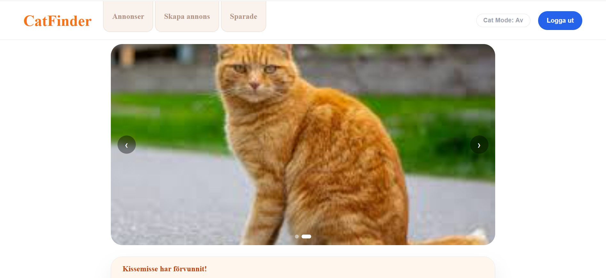
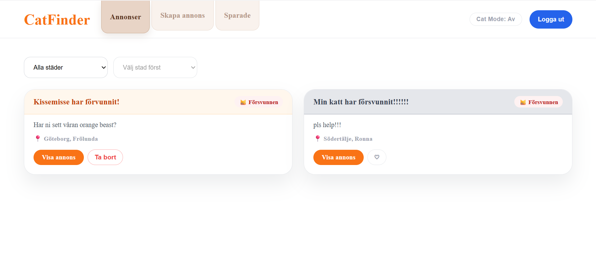

  

A full-stack lost & found cat platform built with ASP.NET Core, React, and SQL Server.
Users can create advertisements for missing or found cats, comment on listings, save advertisements, and manage their account securely using JWT authentication.

  

  

  

